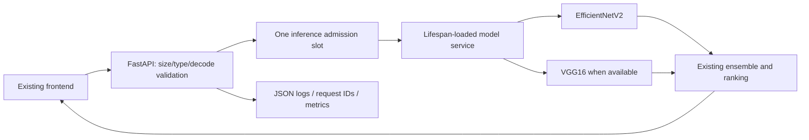

# Sehat Pro inference API

A reliability upgrade around the existing EfficientNet/VGG16 ensemble. It preserves class mapping, 224×224 preprocessing, top-three results and the existing risk-ranking behavior. No training, accuracy improvements or new medical claims are part of this change.



## Setup and API

Use Python 3.11 and `pip install -r requirements.txt`; start `uvicorn main:app --host 0.0.0.0 --port 8000 --workers 1`. Run from the repository root so model paths resolve. `docker build -t sehat .` builds a non-root CPU image. No training compilation is performed; fixed-shape serving functions are compiled once. Models and class mappings load once during lifespan startup and are released on shutdown.

`POST /predict` still accepts the `file` multipart field and returns `predicted_class`, `confidence`, `all_predictions`, `medical_warning` and `requires_urgent_evaluation`. Optional `model_version` and `serving_mode` fields identify the serving configuration. Set `MODEL_VERSION`, `EFFICIENTNET_SHA256`, `VGG16_SHA256` and `CLASS_INDEX_SHA256` for a checked revision. Artifact checksums and output/class-map compatibility are validated on startup.

Only JPEG/PNG with matching MIME, signature and successful decoding are accepted. The upload ceiling remains 10 MB. Dimensions must be at least 16 pixels, no dimension above 8192, and at most 20 million pixels. Responses distinguish 413 size limits, 415 unsupported/mismatched types and 422 corrupted/dimension-invalid images. One inference runs at a time. Up to `PREDICTION_MAX_WAITING` (default 4) requests wait at most `PREDICTION_QUEUE_WAIT_SECONDS` (default 10) for the slot; beyond that, requests get an immediate 429 with Retry-After instead of accumulating buffers or model calls. Image decoding happens inside admission, so large images never decode concurrently. Blocking image decode/inference run outside the event loop.

`/health` is process liveness. `/ready` returns 503 if no valid EfficientNet/class mapping exists, reports degraded readiness when VGG16 is unavailable, and reports ensemble mode when both load. VGG checksum/output mismatch uses the existing EfficientNet fallback. Structured HTTP errors include request IDs. `/metrics` exposes request/error counts, inference attempts and a cumulative request-latency histogram. Application logs are JSON and exclude uploaded images; native ML-library warnings may remain text.

The direct-peer rate limiter defaults to 30 prediction attempts/minute and bounds stored peer entries. `RATE_LIMIT_PER_MINUTE` configures it. It is process-local, assumes one replica, and does not trust arbitrary forwarded headers; deployment proxies must supply a trusted client identity before per-user interpretation is claimed.

## Verification and conversion

Lightweight PR checks install `requirements-dev.txt` without TensorFlow and run `python -m pytest tests -q`. The suite covers preprocessing, response compatibility, corrupt/mismatched/oversized images, readiness/fallback, busy admission and rate limiting. Real model experiments are separate:

```bash
python scripts/benchmark.py --baseline-source /path/to/original/main.py --requests 100 --output artifacts/baseline-native.json
python scripts/benchmark.py --requests 100 --output artifacts/upgraded-native.json
python scripts/stress_api.py --requests 100 --concurrency 4 --output artifacts/burst-native.json
python scripts/convert_tflite.py
```

The fixed synthetic corpus contains 50 deterministic PNG inputs with seed 7300930. Hashes, individual latencies, original model checksums and prediction responses are in the raw artifacts. Synthetic comparisons verify numerical behavior, not clinical accuracy. All 100 existing prediction responses matched the baseline, including clinical ranking/warnings.

Float32 TFLite conversion was tested but **not adopted**: VGG16 passed 50/50 labels/top-three rankings with maximum probability difference near 0.0000011; EfficientNet's saved mixed-float16 operations initially failed conversion. Its float32 config clone converted but changed one label and reached a 0.0322 maximum probability difference, exceeding the 0.001 gate. TensorFlow remains the serving runtime.

A hybrid runtime (`VGG16_RUNTIME=tflite`: EfficientNet in Keras, parity-verified VGG16 in TFLite at `models/vgg16.tflite`, generated by `scripts/convert_tflite.py` and not committed) passed the **full ensemble** gate: 100/100 responses kept the same label, top-three ranking and warnings, with a maximum probability difference of 6e-7 (`artifacts/hybrid-native.json`). It was still **not adopted**, because the 512 MB container showed no resource gain: anonymous memory 430 vs 426 MiB, throughput 1.67 vs 2.25 requests/s (`artifacts/container-512m-hybrid.json`). The default stays `keras`; the flag remains for later re-evaluation.

## Measured native results

| Measurement | Baseline | Upgrade |
|---|---:|---:|
| Warm p50 (seconds) | 0.970 | 0.815 |
| Warm p95 (seconds) | 1.034 | 0.897 |
| Sequential requests/second | 1.032 | 1.209 |
| Cold model startup (seconds) | 7.822 | 8.371 |
| Peak native process RSS (MiB) | 725.734 | 731.676 |
| Failures / 100 | 0 | 0 |

These are sequential native Windows inference measurements, with versions recorded in `artifacts/native-environment.json`. They exclude upload/network latency, are single-machine samples and are not production throughput or accuracy claims. The cold-start number includes loading, excludes the separately warmed first serving graph call, and does not represent provider wake-up latency. Native RSS is not container memory.

An earlier 100-request burst at concurrency 4 against the original fail-fast admission (no waiting room) recorded `{'200': 1, '429': 99}` (`artifacts/burst-native.json`). Rejected requests returned in milliseconds and immediately collided with the running inference, so a user double-clicking would be refused. That result led to the bounded wait queue above; the container results below use it.

## 512 MB container results

`python scripts/container_bench.py --image <image> --memory 512m --output artifacts/container-512m.json` starts the image with a hard 512 MB limit and no swap, times cold start to `/ready`, sends 100 requests from 4 concurrent clients, and reads cgroup `memory.peak`, sampled anonymous memory and OOM events. Docker Desktop (WSL2) on one machine; synthetic images; not accuracy evidence.

| Measurement (100 requests, 4 clients, 512 MB) | Fail-fast admission | Bounded wait queue |
|---|---:|---:|
| Successful responses | 1 / 100 | **100 / 100** |
| Overload 429s | 99 | 0 |
| p50 / p95 response time incl. queue wait (s) | — | 1.77 / 1.85 |
| Completed inferences/s | — | 2.25 |
| Cold start to `/ready` (s) | 13.1 | 12.5 |
| Peak anonymous memory (MiB) | — | 426 |
| OOM kills | 0 | 0 |

`memory.peak` reaches the 512 MiB limit in every run because reclaimable page cache from reading model files counts towards it; anonymous memory is the non-reclaimable part. Setting `MALLOC_ARENA_MAX=2` did not change it (425 MiB). The image is 2.43 GB uncompressed.

## Deployment and evidence status

| Status | Evidence |
|---|---|
| Implemented | validated bounded API, lifespan model loading/fallback, one inference slot with bounded waiters, versions/checksums, request IDs, rate limits, metrics, Docker/CI, flagged TFLite VGG16 runtime |
| Measured locally | 21 checks pass; 100 baseline and upgrade real-model inferences; 512 MB container: 100/100 served, 0 OOM; ensemble TFLite parity passed but not adopted |
| Verified live | upgrade not yet deployed/verified |
| Gate result | **fails the 400 MB margin**: 512 MiB total cgroup peak (426 MiB sampled anonymous memory) under a 512 MB limit. It serves without OOM, but with too little headroom to call it safe on a 512 MB host |

GitHub Actions tests the lightweight API and builds Docker before any configured deployment hook. The 512 MB gate requires 100 requests without OOM **and** peak memory below 400 MB; the second condition is not met. The remaining footprint is the TensorFlow runtime plus two models. Options are a larger free tier, EfficientNet-only (degraded) serving, or a later fully verified TFLite/ONNX runtime. Hugging Face CPU/Docker creation now requires a paid plan, so it is not an assumed free fallback. No paid resources are provisioned.

Keep the previous commit and TensorFlow artifacts for rollback. Deploy only a validated revision. Resume and portfolio copy are unchanged.
